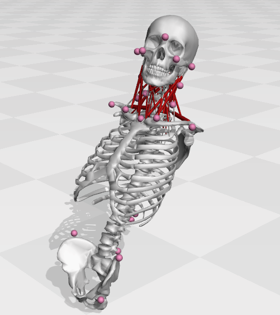

# Description

This repository contains the working OpenSim (https://simtk.org/projects/opensim) model files for a kinematic model of a human torso, neck, and head that is suitable for tracking optical tracking passenger data that involves torso movements of around 10-30 cm. The pelvis is attached to the ground through a free joint, the lumbar spine comes from Christophy et al. (with a small change), and the neck model comes from Mortensen et al. The marker set has been custom designed to suit an experiment in a mechanical car simulator. To explore the models it is best to load them in OpenSim Creator (https://www.opensimcreator.com/)

# Note

2026/04/09

The attachment points for longissi_cerv_c4thx_L are 3-4 mm too low on the passengerModel: it passes through the transverse process of T8. This happened because the Christophy et al. and Mortensen et al. models have different locations for the torso frame relative to the ribcage, because the Christophy et al. model has a lumbar spine, and the Mortensen et al. model has one large lumped torso segment. To attach the muscles to the same location on the torso, we had to calculate the offset between the torso frames of both models and add this to the attachement point locations of the muscles that attach to the torso. To do this, the passengerModel should first be scaled to have the same height as the Mortensen model, then the offset can be calculated and applied to the few muscles that attach to the torso. Instead, we did not scale the passengerModel before applying the offset, and so, an offset appropriate for the 1803.4 mm tall Mortensen et al. model was applied to the 1700 mm tall passenger model. This offset is a bit too big.

 2026/04/10

When I manually merged the Christophy et al. model (1700 mm tall) with the Mortensen et al. model (1803.4 mm tall) I changed the scale factors of the meshes, and the scale applied to the translation parts of the custom joints. I failed to update the PhysicalOffsetFrame's translation field, the optimal fiber length and tendon slack length. This means the following:

 -  The passengerModel's neck joint centers, optimal fiber lengths, and tendon slack lengths come from Mortensen et al. and were not scaled. That means these measures are sized for someone 1803.4 mm tall, but attached to the 1700 mm tall passenger model. Not good. The errors will be on the order of  6% (1803.4/1700-1).

 -  The passengerModel's torso mass comes from Christophy et al. They don't mention the mass explicitly, but say that they started with the Arnold 2010. The Arnold 2010 paper mentions they got the height from Gordon et al. Gordon et al. on page 193 has a list of height (stature) for the people that they looked at. A 1700 mm height would be just below a 25th percentile male. On page 225 the masses of the participants is listed: the 25th percentile male is 75.60 kg (166.67 lbs). The mass of the Mortensen et al. model is 79.54 kg (175 lbs).

 - That means that the masses and inertia's of the passengerModel's torso are consistent with someone who's 75.6 kg and 1700 mm tall, while the head and neck have inertias that are consistent with someone who is 79.54 kg and 1803.4mm tall. Not good. The mass errors will be on the order of 5.2% (79.54/75.6-1), while the inertia errors will be on the order of 17.9% ( (1.8*1.8*79.54)/(1.7*1.7*75.6) ).
       
If I had the time, I would do the following:

 1. Scale the Christophy et al.'s size by 1803.4/1700, and mass by 79.54/75.60 to bring it to a size that is appropriate for the Mortensen et al. model. I'd use the version of the Christophy model that just contains the skeleton: models/reference/Christophy2012_axialRotationUpd_skeletonOnly
 2. Manually merge the scaled Christophy et al. model with the Mortensen et al. model. This step currently has to be done manually by editing the XML.
 3. Calculate the difference in the vectors from the torso frame to the T1 frame. This difference, or offset, needs to be applied to all of the points that the neck muscles attach to.
 4. Pose the Mortensen model and the new passengerModel with the same generalized coordinates. Since both models are the same height now (1803.4 mm), if everything went well, all of the lengths of the muscles should match identically.

# Model Description

 - *models/passengerModel.osim*\
        Kinematic model of the passenger. This model is designed specifically to track motion capture data recorded in a car, where it is not possible to put many markers on the torso (due to the seat belt). As a result, we have added the pelvis and a flexible torso so that we can estimate the location of the torso using markers on the shoulders and clavicle. In this setting, the pelvis is constrained to remain in contact with the seat and the model is tilted backwards to be consistent with the angle of the back rest which we manually measure. 
        
 - *models/passengerModelMuscles.osim*\
        This model includes the neck muscles that appear in the Mortensen 2018 model. Note that we had to update the local offset vectors so that the muscles that attached to the torso attached at the correct location. This update was needed because the original Mortensen et al. 2018 model uses a rigid torso while this model includes Christophy et al.'s flexible lumbar spine. The edited points of attachment have been visually compared to models/Mortensen2018_rigidTorso.osim.
        
 - *reference/Christophy2012_axialRotationUpd_skeletonOnly.osim*\
        This is the model of Christophy 2012 et al. but only with the skeleton, joints, and coupling constraints. The coefficients of the axial coupling constraints have been updated from the original publication so that an axial_rotation of 45 degrees results in an axial rotation of the torso with respect to the pelvis of 45 degrees. This is described in detail on the SimTK forum for this model. Go to https://simtk.org and search for 'Musculoskeletal Model of the Lumbar Spine', go the forum of this model, then look at the post titled 'Axial rotation coordinate coupling coefficients update'. Or just use this link [Axial rotation coordinate ...](https://simtk.org/plugins/phpBB/viewtopicPhpbb.php?f=567&t=18771&p=0&start=0&view=&sid=ee1fa9fe49baefde716abe720cefe1a4) 

 - *reference/Mortensen2018.osim*\
        This is the model of Mortensen et al.

 - *OpenSimConfigurationFiles/Scale_Setup.xml* and *OpenSimConfigurationFiles/IK_Setup.xml*
       Example configuration files to scale the passengerModel and passengerModelMuscles models and use the inverse-kinematics solver.

# Model Creation Process

The models passengerModel.osim and passengerModelMuscles.osim have been made by merging the torso of Christophy et al. with the head-neck model of Mortensen et al. These models are of different people: Christophy et al. made a model of a 1700 mm tall male, while Mortensen et al. made a model of a 1803.4 mm (5'11") tall male.
Prior to merging the different parts of the body had to be scaled so that each part was consistent with the 1700 mm tall male model of Christophy et al.

 - *Pelvis*, *sacrum*, *L5-L1*, and *torso* scaling
       We kept the original scale factors (0.87) that Christophy et al. used to scale the geometry of their model to be consistent with a 1700 mm tall male. This scale factor can be seen in models/scaling/Christophy2012_axialRotationUpd_skeletonOnly.osim by in the scale_factors field of all bodies except the pelvis. In the passengerModels we ahve also applied a scale factor of 0.87 to the pelvis, and have updated the sacrum_offset so that the iliac crests align correctly with the sacrum.

 - *C1-C7*, *skull*, *jaw*, *scapula*, *clavicle*
       We have scaled C1-C7 geometry, C1-C7 joint offsets, the skull, and jaw using a ratio of the heights of the Christophy et al. model and the Mortensen et al. model : 1700/1803.4 = 0.9426638571587

After merging, we corrected an error in the coupler constraint weights applied to the axial rotation of Christophy et al.'s lumbar joint which is described in detail in the next section. An image of the passengerModel, Christophy et al. model, and Mortensen et al. models side-by-side can be found in the models/media:

 - passengerModel_Christophy_Mortensen.png [image]
 - passengerModel_Christophy_Mortensen.blend [blender file]
 - passengerModel.dae, Christophy.dae, Mortensen.dae [geometry exported from OpenSim Creator]

# Christophy et al. 2012 axial rotation coordinate coupler constraint corrrection

The axial rotation of the rib cage with respect to the pelvis does not follow the generalized coordinate axial_rotation. In contrast, flexion/extension have been implemented so that when flex_extension is set to 45, the rib cage rotates with respect to the pelvis by 45 degrees. The same for lateral bending. As such, it is likely that Christophy et al. had the design intent of also having the axial rotation of the rib cage with respect to the pelvis be equal to the generalized coordinate axial_rotation. Please note that this error does not mean that the model is broken, but it does mean that the numerical value of the axial rotation coordinate does not correspond to the rotation between the pelvis and rib cage which is confusing. 

To elaborate, Christophy entered these coefficients in Lumbar_C_210.osim

  - L1/L2: 0.02888888890000000000 (line 15915)
  - L2/L3: 0.03111111111100000100 (line 15882)
  - L3/L4: 0.03777777799999999800 (line 15849)
  - L4/L5: 0.03777777699999999800 (line 15816)
  - L5/S1: 0.030329999999999999   (line 14674)
  - Sum  : 0.1711

Since the sum of these coefficients is only 0.1711, if you apply an axial_rotation of say pi/4 radians (45 degrees) you see that the torso rotates by only 0.0428 pi radians (7.7 degrees). If we look at the orginal research, Fugii et al. reports that during their MRI study each lumbar joint twisted by

  - L1/L2: 1.3 degrees
  - L2/L3: 1.4
  - L3/L4: 1.7
  - L4/L5: 1.7
  - L5/S1: 1.6 

when there was a 45 degree rotation between the trunk and the pelvis. If you scale these coordinates by 45 degrees you get the coefficients used by Christophy et al. However, we are only concerned with what the lumbar spine is doing, and so it does not matter that the trunk rotated by 45 degrees: the additional axial rotation is taking place at other joints (the thorasic spine and scapulothorasic joints) that have nothing to do with the lumbar spine. Instead, we normalize these coefficients so that the final result sums to 1 which yields

  - L1/L2: 0.168831168831169
  - L2/L3: 0.181818181818182
  - L3/L4: 0.220779220779221
  - L4/L5: 0.220779220779221
  - L5/S1: 0.207792207792208
  - Sum  : 1

With these coefficients when the axial_rotation is set to 45 degrees, for example, the sum total of the axial rotation applied to the lumbar spine is 45 degrees. The passengerModel.osim and passengerModelMuscles.osim use the proposed coefficients for the axial coordinate coupler constraint.

# References

 - Arnold EM, Ward SR, Lieber RL, Delp SL. A model of the lower limb for analysis of human movement. Annals of biomedical engineering. 2010 Feb;38(2):269-79.

 - Christophy M, Faruk Senan NA, Lotz JC, O’Reilly OM. A musculoskeletal model for the lumbar spine. Biomechanics and modeling in mechanobiology. 2012 Jan;11:19-34.

 - Fujii R, Sakaura H, Mukai Y, Hosono N, Ishii T, Iwasaki M, Yoshikawa H, Sugamoto K (2007) Kinematics of the lumbar spine in trunk rotation: In vivo three-dimensional analysis using magnetic resonance imaging. Eur Spine J 16(11):1867–1874

 -Gordon CC, Blackwell CL, Bradtmiller B, Parham JL, Barrientos P, Paquette SP, Corner BD, Carson JM, Venezia JC, Rockwell BM, Mucher M. 2012 anthropometric survey of us army personnel: Methods and summary statistics. 2014 Dec 5.

 - Mortensen JD, Vasavada AN, Merryweather AS. The inclusion of hyoid muscles improve moment generating capacity and dynamic simulations in musculoskeletal models of the head and neck. PloS one. 2018 Jun 28;13(6):e0199912.

